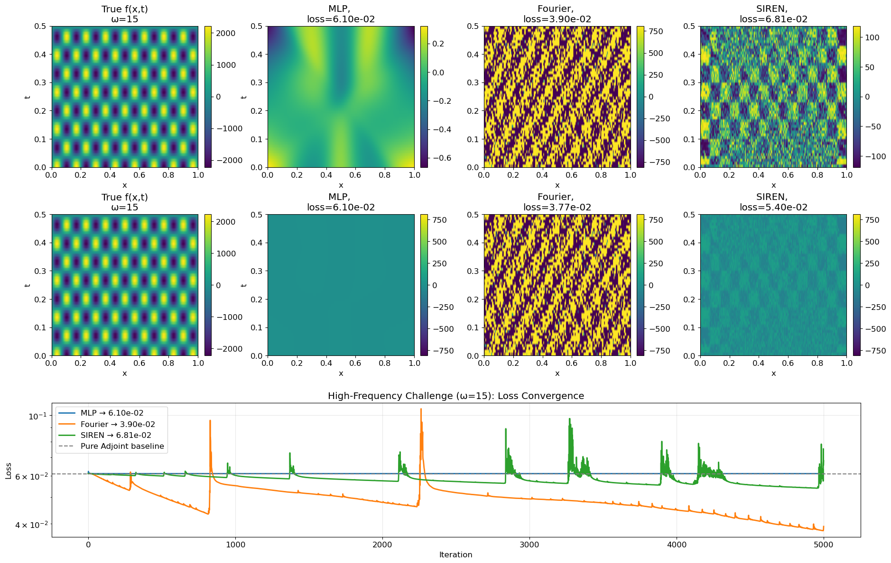

# Adjoint Method for PDE-Constrained Optimization

Neural network-parameterized source estimation for heat equations using the adjoint method. Part of a group project comparing four approaches to PDE-constrained optimization.

## Project Context

This repository implements **Method 3 (Pure Adjoint)** and **Method 4 (Adjoint + NN)** within a 2×2 comparison framework:

|  | Grid Parameterization | NN Parameterization |
|---|---|---|
| **Autodiff Gradient** | Pritam's work | Mark's work |
| **Adjoint Gradient** | **Yifan — Pure Adjoint** | **Yifan — Adjoint + NN** |

The key innovation of Method 4 is combining the **adjoint method** for efficient PDE gradient computation with **neural network parameterization** for implicit regularization and spectral control.

## Method Overview

### Pure Adjoint (Baseline)
Optimize the source term `f(x,t)` directly on the discretization grid using adjoint-based gradients:

```
Forward:   u_t - α u_xx = f        →  solve for u(f)
Loss:      J = ½ ||u(f) - u_obs||²
Adjoint:   -p_t - α p_xx = u - u_obs  →  solve backward for p
Gradient:  ∇_f J = p               →  update f ← f - lr · p
```

### Adjoint + NN (Hybrid)
Parameterize `f(x,t) = NN(x, t; θ)` and use the chain rule:

```
∇_θ J = (∂f/∂θ)ᵀ · ∇_f J
         ╰─ JAX ─╯   ╰─ adjoint ─╯
```

Implementation uses `jax.custom_vjp` + `jax.pure_callback` to wrap the numpy PDE solver as a JAX-differentiable black box. The backward pass computes the **exact discrete adjoint** (discretize-then-optimize) so that the gradient matches finite differences to machine precision.

## Repository Structure

```
adjoint-method/
│
├── README.md                       # This file
├── .gitignore
│
├── src/                            # Core source code
│   ├── __init__.py                 #   Package init (re-exports all public API)
│   ├── pde_adjoint_solver.py       #   Forward & adjoint PDE solvers (numpy)
│   ├── problems.py                 #   Problem registry (Problem 1–3, high-osci, problem4 alias)
│   └── adjoint_nn.py               #   Adjoint+NN hybrid (JAX/Flax/Optax)
│
├── scripts/                        # CLI experiment runners
│   ├── run_phase2.py               #   Phase 2: reproducible runs + metrics export
│   ├── baseline_verification.py    #   Phase 1: baseline reproduction
│   └── regression_checks.py        #   Lightweight regression checks for fixed bugs
│
├── notebooks/                      # Jupyter notebooks
│   ├── Adjoint_NN_Demo.ipynb       #   Interactive demo & walkthrough
│   └── legacy/                     #   Original explorations (pre-refactor)
│       ├── Problem1.ipynb
│       ├── Problem2_updated.ipynb
│       ├── Problem3.ipynb
│       ├── HighOsci.ipynb
│       └── BS_Model.ipynb
│
├── results/                        # Generated plots (gitignored)
└── data/                           # Data files
```

## Quick Start

### Environment Setup

```bash
# Recommended pinned stack (avoid JAX/Flax mismatch)
pip install \
  "jax[cpu]==0.4.28" \
  "flax==0.8.5" \
  "optax==0.2.2" \
  "numpy<2.0" \
  "scipy>=1.10,<1.13" \
  "matplotlib>=3.5"
```

If you see `AttributeError: module 'jax.sharding' has no attribute 'AbstractMesh'`,
your JAX/Flax versions are incompatible and must be re-pinned.

### Run Gradient Verification

```bash
python scripts/run_phase2.py --verify
```
Expected output: `PASS` with relative error < 1e-5 for all problems.

```bash
python scripts/regression_checks.py
```
Expected output: all checks `PASS` (problem4 alias, scheme-aware time-index update,
baseline relative save path, lazy import behavior).

### Run Experiments

```bash
# Problem 2: Pure Adjoint vs Adjoint+NN
python scripts/run_phase2.py --problem2

# High-frequency challenge (ω=15): MLP vs Fourier vs SIREN
python scripts/run_phase2.py --highosci

# Problem 4 baseline (alias to high-osci): Pure Adjoint only
python scripts/run_phase2.py --problem4

# Run everything
python scripts/run_phase2.py
```

All runs export:
- `results/phase2/metrics.json`
- `results/phase2/summary.md`

### Interactive Demo

```bash
cd notebooks
jupyter notebook Adjoint_NN_Demo.ipynb
```

## Key Results

### Gradient Verification ✅
Discrete adjoint gradient matches finite differences to machine precision:
- Problem 2: max relative error = **1.41e-08**
- High-osci (ω=15): max relative error = **7.39e-06**

### Problem 2 — Pure Adjoint vs Adjoint+NN
| Method | Final Loss (3000 iter) | Improvement |
|---|---|---|
| Pure Adjoint | 5.63e-05 | baseline |
| **Adjoint+NN (MLP)** | **5.62e-06** | **10.0× better** |

### High-Frequency Challenge (ω=15)
| Method | Final Loss (5000 iter) | Notes |
|---|---|---|
| Pure Adjoint | 6.05e-02 | ~0% reduction from its own initialization |
| Adjoint+MLP | 6.10e-02 | ~0% reduction, strong spectral bias |
| **Adjoint+Fourier** | **6.23e-03** | **89.8% reduction**, best on ω=15 |
| Adjoint+SIREN | 5.45e-02 | 10.7% reduction, still unstable |

### High-Osci Visualization
The latest notebook comparison figure (original scale + unified scale + loss curves):



## Technical Details

### Discrete vs Continuous Adjoint

A critical implementation detail: the `custom_vjp` backward pass must use the **discrete adjoint** (differentiate the discrete equations), not the **continuous adjoint** (discretize the continuous adjoint PDE). Only the discrete adjoint gives the exact gradient `∂J/∂f` matching finite differences.

For implicit Backward Euler (`A · u_{n+1} = u_n + dt · f_{n+1}`):
```
Discrete adjoint:    A · μ_n = μ_{n+1} − (u_n − u_obs_n) · dx · dt
Gradient:            ∂J/∂f_m = −dt · μ_m
```

The continuous adjoint (`-p_t - α p_xx = misfit`) gives a gradient that differs by scaling factors and time-index shifts — fine for pure adjoint optimization (learning rate absorbs the difference) but incorrect for `custom_vjp`.

### NN Architectures

| Architecture | Key Feature | Best For |
|---|---|---|
| **SourceMLP** | Standard tanh MLP | Low-frequency problems |
| **FourierMLP** | Random Fourier feature input encoding | High-frequency problems (set `frequency_scale ≈ ω`) |
| **FixedFourierMLP** | Deterministic Fourier basis (`arch=fourier_fixed`) | High-osci stability + reproducibility |
| **SIREN** | sin activation with ω₀ scaling | Periodic signals (needs careful LR tuning) |

### Problem Definitions

| Problem | Solution u(x,t) | Scheme | Key Challenge |
|---|---|---|---|
| `problem1` | sin(2πx) + sin(πt) | Explicit | Additive, fastest convergence |
| `problem2` | [sin(πx) − 0.5sin(2πx)] sin(πt) | Implicit | Multi-mode spatial structure |
| `problem3` | sin(2πx) cos(πt) | Explicit | Separable standing wave |
| `high-osci` | sin(15πx) cos(15πt) | Implicit | ω=15, extreme spectral bias |
| `problem4` | alias to `high-osci` | Implicit | Naming alias used in report |

## Development Progress

### ✅ Phase 1 — Code Refactoring & Baseline (Complete)
- [x] Modular forward/adjoint solvers (`pde_adjoint_solver.py`)
- [x] Problem registry with factory pattern (`problems.py`)
- [x] Baseline verification — all 4 problems match original notebooks
- [x] Sign convention fix (unified `+residual` in adjoint, `+p` gradient)

### ✅ Phase 2 — Adjoint + NN Hybrid (Complete)
- [x] `jax.custom_vjp` + `jax.pure_callback` wrapping numpy solver
- [x] Discrete adjoint gradient (discretize-then-optimize)
- [x] Gradient verification PASS (< 1e-5 relative error)
- [x] Three Flax architectures: MLP, FourierMLP/FixedFourierMLP, SIREN
- [x] Problem 2 comparison: Adjoint+NN (MLP) ~10× better than Pure Adjoint
- [x] High-frequency experiment update: Fourier reaches 6.23e-03 (~89.8% reduction)
- [x] `problem4` alias formalized (`problem4 == high-osci`)
- [x] Training metrics added (`wall_time_sec`, `sec_per_1000_iter`, `best_loss`)
- [x] Notebook comparison plots upgraded (dual-scale heatmaps + non-overlapping layout)

### ✅ Phase 2.5 — Robustness & Reproducibility (Complete)
- [x] Scheme-aware time-index update fix is regression-protected
- [x] Relative output paths in baseline scripts
- [x] Lazy imports in `src/__init__.py` (numpy-only usage without JAX)
- [x] Lightweight regression suite (`scripts/regression_checks.py`)

### 🔲 Phase 3 — Alignment & Extensions (In Progress)
- [ ] Align grid conventions with Mark's NN solver (interior-only vs boundary-inclusive)
- [ ] Shared problem definitions across both codebases
- [ ] ResNet / ModifiedMLP architectures from Mark's code
- [ ] Hyperparameter tuning for SIREN on high-frequency problems
- [ ] Extended comparison table across all four methods

### 🔲 Phase 4 — 2D & Advanced Problems (Future)
- [ ] 2D heat equation extension
- [ ] Wave equation support
- [ ] Advection-diffusion problems
- [ ] Convergence analysis and scaling studies

## Dependencies

```
jax[cpu] == 0.4.28
flax == 0.8.5
optax == 0.2.2
numpy < 2.0
scipy >= 1.10, < 1.13
matplotlib >= 3.5
```

## References

- Khimin, D. et al. "Optimal control of partial differential equations using neural network surrogates" (arXiv:2408.12404)
- Tancik, M. et al. "Fourier Features Let Networks Learn High Frequency Functions in Low Dimensional Domains" (NeurIPS 2020) — FourierMLP
- Sitzmann, V. et al. "Implicit Neural Representations with Periodic Activation Functions" (NeurIPS 2020) — SIREN
